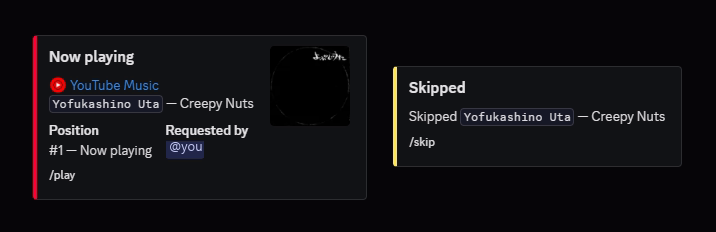

<div align="center">


# Ditto

**A Discord bot for voice-channel moderation and music.**

Node.js · discord.js 14 · @discordjs/voice · yt-dlp · FFmpeg

[](https://github.com/da0t-exe/Ditto)
[](#install)
[](LICENSE)



</div>

## What it is

Two things one server actually needs, in one bot: a set of blunt voice-channel
tools for whoever holds **Move Members**, and music that starts quickly and
plays the track you asked for.

Music is open to everyone. Nobody gets a private remote control over the
channel: the person who queued a track can skip it instantly, anyone else needs
half the listeners to agree.

## Music

`/play` · `/playlist` · `/skip` · `/stop` · `/pause` · `/resume` · `/queue` · `/nowplaying` · `/volume` · `/settings` · `/sudo`

**Search**

- Queries hit the **YouTube Music** catalogue first — one HTTP call, ~0.4 s,
  songs only. That is why you get the track instead of a reaction video or a
  ten-hour loop, and why the artist, album, duration and real album art are
  already attached.
- A Deezer/iTunes lookup runs *alongside* it and the two cross-check each
  other. The catalogue rescues typos the music index misses; the music index
  rejects the wrong-artist uploads the catalogue sometimes matches.
- When neither is confident, the bot falls back to a broad YouTube search —
  slower, but it reaches uploads YouTube Music never indexes.

**Playback**

- Audio streams through `yt-dlp → FFmpeg → Opus`. Nothing about joining the
  channel or fetching album art blocks the first byte of sound.
- While a track plays, the **next one's pipeline is built in the background**,
  about 25 s before the current track ends. Moving through a queue or a
  playlist is close to gapless.
- Links from Spotify, Apple Music, Deezer and song.link resolve to the matching
  YouTube source. Playback itself is always YouTube.
- The bot joins whoever ran the command, and leaves on `/stop` or when the last
  human does.

## Voice moderation

Requires **Move Members**.

| | |
|---|---|
| `/move` | Move everyone from one voice channel to another |
| `/stick` | Lock a channel — members who leave get pulled back |
| `/unstick` | Unlock it |
| `/stick-status` | Show locked channels and tracked members |
| `/wake-up` | Bounce a user through random channels, then drop them somewhere |
| `/dm-all` | DM the whole server — **Administrator**, 100 recipients, 24 h cooldown |

Locked channels and the `/dm-all` cooldown are written to disk, so a restart
does not quietly unlock everything or reset the limit.

> Discord only lets a bot move a member who is **already** connected to voice.
> A disconnected user cannot be pulled in.

## Permissions

| Command group | Needs |
|---|---|
| Music | anyone |
| `/settings` and voice moderation | Move Members |
| `/dm-all`, `/sudo` | Administrator |

`/sudo` overrides the **last denied** music command in that channel — a lost
skip vote, or a "you must be in a voice channel". It does nothing when there is
nothing to override, and it is not a replacement for `/play`.

## Install

Needs [Node.js](https://nodejs.org/) 18+, FFmpeg on the host, and a Discord
application with the bot already invited.

Invite it with `Connect`, `Speak`, `Move Members`, `View Channels`,
`Send Messages`, and enable the **Server Members** intent in the Developer
Portal.

```bash
git clone https://github.com/da0t-exe/Ditto.git
cd Ditto
npm install
cp .env.example .env
```

```env
BOT_TOKEN=your_bot_token
CLIENT_ID=your_application_id
GUILD_IDS=your_guild_id
```

Leave `GUILD_IDS` empty to register commands globally — Discord then takes a few
minutes, sometimes an hour, to show them. Filling it in registers per server,
instantly.

Optional: `FFMPEG_PATH` if FFmpeg is not on `PATH`, and `EMOJI_YOUTUBE` /
`EMOJI_YOUTUBE_MUSIC` for custom source emojis.

## Running

```bash
npm run deploy
npm start
```

`npm run deploy` registers the slash commands. Run it once, and again whenever
a command changes.

| | |
|---|---|
| `npm start` | Run the bot |
| `npm run deploy` | Register slash commands, then exit |

yt-dlp is found on the system, taken from `node_modules`, or downloaded into
`bin/` on first run. It self-updates at most once a day.

## Deploying on Pterodactyl

Keep the startup command as `npm start` and nothing else — no `git`, no
`npm install`, no `npm run deploy`.

`npm run deploy` exits 0, which the panel reads as a crash. Run it once from the
console (or temporarily as the start command), then set startup back to
`npm start`.

To update: `git fetch origin && git reset --hard origin/main` once, then start.

## Project layout

```
src/index.js     Bot client, /move, /stick, /wake-up, /dm-all
src/deploy.js    Slash command registration
src/music.js     Music commands, embeds, settings UI
src/player.js    Playback engine — yt-dlp, FFmpeg, queue, preloading
src/resolve.js   Link and playlist resolution, result ranking
src/ytmusic.js   YouTube Music search client (InnerTube)
src/store.js     Small JSON store for state that survives a restart
```

State lives in a git-ignored `data/` directory, so `git reset --hard` never
wipes it:

| | |
|---|---|
| `data/guild-settings.json` | Per-server `/settings` |
| `data/bot-state.json` | Locked channels, `/dm-all` cooldowns |
| `data/yt-dlp-update.json` | Last yt-dlp update check |

## License

MIT — see [LICENSE](LICENSE).

<div align="center">
<sub>Built by <a href="https://github.com/da0t-exe">da0t-exe</a></sub>
</div>
