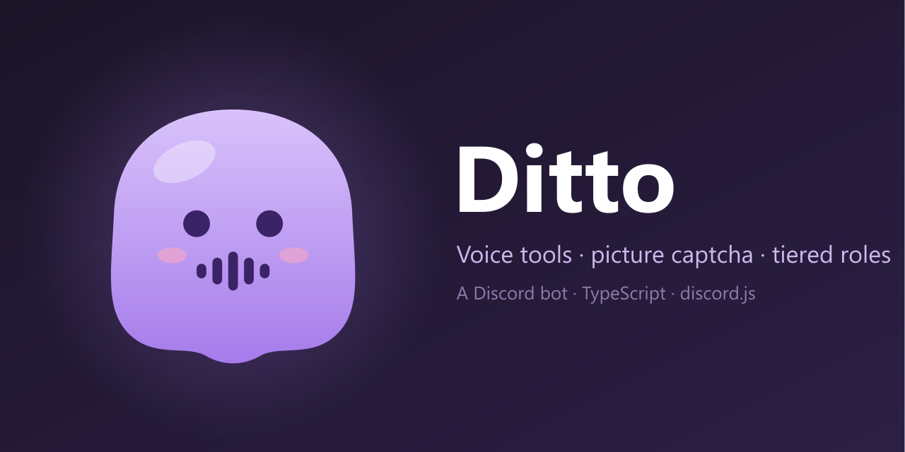

<div align="center">



[](https://github.com/da0t-exe/Ditto/releases)
[](#install)
[](https://discord.js.org)
[](LICENSE)

</div>

**Ditto** is a Discord bot for the voice side of a server and the door in front
of it: a picture captcha for newcomers, roles that read cleanly on a profile,
and voice tools for moderators. It speaks **English and French**, and
everything is configured from Discord with `/setup`.

> **Music is on the way.** It will run on Lavalink and is not in this version yet.

## Features

### 🔐 Picture captcha

Newcomers see a single channel with a **Verify me** button. It opens a private
3×3 grid of photos — *"select every image with traffic lights"* — with nine
buttons laid out like the grid.

- Photos come from [Open Images](https://storage.googleapis.com/openimages/web/index.html):
  traffic lights, bicycles, buses, cars, motorcycles, fire hydrants, stop signs,
  boats, palm trees, street lights and stairs. Drawings are excluded.
- A tile is a right answer only when the object fills enough of it, and a photo
  where it shows up small is never used as a wrong answer — no trick tiles.
- **No grid is served twice.** Every grid's fingerprint is stored, the least
  shown photos come first, and each tile is cropped, flipped and tinted at random.
- Three misses mean a Discord **timeout** (10 minutes). Nobody is kicked.
- **Quarantine:** members brought in by a member-pushing bot are recognised
  from Discord's join source and get a quarantine role instead.

The photo pool (about 2,000 images, ~35 MB) builds itself on the first start.

### 🎨 Roles

- After the captcha, members pick a **colour** and their **games** from two
  menus; `/roles` brings them back later.
- **Tier titles.** Name a role like `━━ Games ━━` and it becomes the title of
  every role below it. Ditto gives members the title only while they hold a
  role of that tier, so profiles read as tidy floors with no empty headings.

### 🔊 Voice

Needs **Move Members**.

| Command | |
|---|---|
| `/move` | Move one member, everyone in voice with a role, or a whole channel |
| `/gather` | Pull everyone in voice into one channel — with a button to send them all back |
| `/split` | Shuffle a channel into 2–4 teams across empty rooms |
| `/disconnect` | Disconnect a member or a whole channel |
| `/shake` | Bounce a member through random channels, with a Stop button |
| `/lock` | Lock a channel, optionally for a while (`30m`, `2h`) — whoever leaves is pulled back |
| `/unlock` · `/locks` | Unlock, or list locks with an unlock menu |

- **Rooms.** The first person in an empty room owns it and can rename, cap,
  lock, invite into or hand over the room with `/room`. When the last person
  leaves, the room goes back to its original name, limit and permissions.
- Staff are never pulled back by a lock, and a move made with a Ditto command
  stops the lock from tracking that member.
- Members deafened for 10 minutes are moved to the AFK channel, and joins,
  leaves and moves go to the log channel. Both can be switched off.

## Setting up a server

1. **Invite Ditto** with this link (replace `YOUR_CLIENT_ID`):

   ```text
   https://discord.com/oauth2/authorize?client_id=YOUR_CLIENT_ID&scope=bot+applications.commands&permissions=1099798006800
   ```

   It asks for View Channels, Send Messages, Embed Links, Attach Files, Read
   Message History, Manage Channels, Manage Roles, Connect, Move Members and
   Timeout Members.
2. In **Server Settings → Roles**, drag Ditto's role **above** every role it
   hands out (member, pending, quarantine, colours, games, tier titles).
3. Run **`/setup`**. It opens a panel with four pages — Verification,
   Quarantine, Roles, Voice & logs — where you pick each role and channel from
   a menu. **Auto-detect** fills in what it can guess from common English and
   French names, and never overwrites a choice you already made.

To put the captcha in front of the whole server: take every permission away
from `@everyone`, give them to the member role instead, and let `@everyone`
see only the verification channel.

| Command | Who |
|---|---|
| `/roles`, `/room` (in a room you own) | anyone |
| Voice commands | Move Members |
| `/setup`, `/captcha test · reset · panel · reload` | staff roles, Administrator, server owner |

The server owner — and the user in `OWNER_ID` — pass every check.

## Install

Needs [Node.js](https://nodejs.org/) 20+ and a Discord application with the
**Server Members** intent enabled in the Developer Portal.

```bash
git clone https://github.com/da0t-exe/Ditto.git
cd Ditto
npm install
cp .env.example .env
npm start
```

`BOT_TOKEN` is the only required variable. Slash commands are registered on
every server each time the bot starts, so they appear instantly — there is no
separate deploy step.

| Variable | |
|---|---|
| `BOT_TOKEN` | The bot's token — **required** |
| `OWNER_ID` | A user who passes every permission check |
| `GUILD_IDS` | Comma-separated servers to run on (empty = all) |
| `DATA_DIR` | Where state is kept (default `data/`) |
| `CAPTCHA_AUTOFETCH=0` | Do not build the photo pool on startup |

| Script | |
|---|---|
| `npm start` | Run the bot |
| `npm run dev` | Run and restart on file changes |
| `npm run typecheck` | Type-check without running |
| `npm run captcha:fetch` | Build or top up the photo pool by hand |

### Hosting on Pterodactyl

Use a **Node.js 20+** image (22 recommended) with `npm start` as the startup
command. To update, set the startup command to this once, start the server,
then set it back to `npm start`:

```text
git fetch origin && git reset --hard origin/main && npm install --omit=dev && npm start
```

`.env` and `data/` are git-ignored, so the reset never touches them.

## Project layout

```
apps/bot/src/
  index.ts              Client, startup, per-server command registration
  core/                 Config, SQLite, i18n, permissions, logging, shared UI
  features/setup.ts     The /setup panel and auto-detection
  features/captcha/     Photo pool builder, grid generator, verification flow
  features/roles/       Colour and game picker, tier titles
  features/voice/       Voice commands, locks, rooms, auto-AFK, voice log
assets/                 Logo and banner (SVG sources + PNG)
```

State lives in the git-ignored `data/` folder: `data/ditto.db` (settings,
locks, rooms, captcha history) and `data/captcha/` (photos and their manifest).

## Credits

Captcha photos come from [Open Images](https://storage.googleapis.com/openimages/web/index.html)
and are licensed CC BY 2.0; each photo's author and source are listed in
`data/captcha/manifest.json`.

## License

MIT — see [LICENSE](LICENSE).
