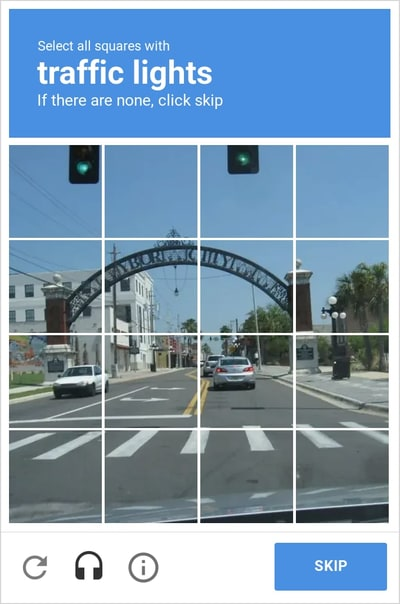
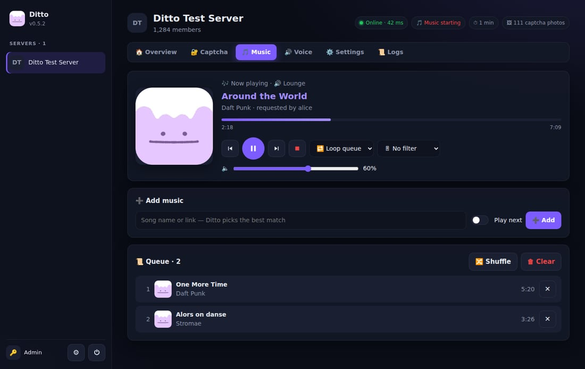

<div align="center">


# Ditto

Voice tools, music, a reCAPTCHA-style captcha and a web dashboard for Discord.

<a href="https://github.com/da0t-exe/Ditto/releases"></a>


<a href="LICENSE"></a>

</div>

Ditto looks after the voice side of a server and the door in front of it: a
captcha for newcomers, music for everyone, voice tools for moderators, and a
dashboard to run it all from the browser. Everything is set up from Discord with
`/setup` — **Quick setup** does it in one click.

## Features

### 🔐 Captcha



Newcomers only see a verification channel with a **Verify me** button. It opens a
private challenge drawn exactly like a reCAPTCHA 4×4 image challenge — same
header, same grid, same footer, measured pixel for pixel — with sixteen buttons
laid out like the squares, and **Skip** turning into **Verify** as soon as a square
is ticked.

- A **photo database ships with Ditto**: 111 hand-picked street photos from
  [Open Images](https://storage.googleapis.com/openimages/web/index.html) with the
  exact position of every object — traffic lights, bicycles, buses, cars,
  motorcycles, fire hydrants, stop signs, boats, palm trees, street lights and
  stairs. Nothing to download.
- Squares the object clearly fills must be ticked; squares it only brushes, or that
  show a look-alike (a taxi when asked for cars), are accepted either way. Some
  challenges have nothing to tick: the answer is **Skip**.
- **Instant**: a few challenges are always drawn in advance, so the picture appears
  the moment the button is pressed, and a miss swaps it at once.
- **No challenge is served twice.** Each one is fingerprinted, the least shown
  photos come first, and every photo is zoomed, shifted, mirrored and tinted.
- After a few misses (3 by default), a Discord **timeout**. Nobody is kicked.
- **Quarantine:** members brought in by a member-pushing bot are recognised from
  Discord's join source and get a quarantine role instead.

### 🎵 Music

- `/play` takes a song name or a link — no list to pick from: Ditto searches
  YouTube Music's songs and keeps the best match, skipping remixes, live and
  sped-up versions you did not ask for.
- Links from **YouTube** (Shorts and YouTube Music included), **SoundCloud**,
  **Bandcamp**, **TikTok**, **Twitch**, **X**, **Instagram** and **Vimeo** play
  directly. **Spotify**, **Apple Music**, **Deezer** and **Tidal** tracks are
  matched on YouTube Music; Spotify, Apple Music and Deezer albums and playlists too.
- **Fast:** Ditto joins the voice channel while it searches, looks up the next two
  tracks while the current one plays, and remembers stream addresses, so tracks
  start straight away. Nothing it runs in the background can freeze the bot.
- **Smooth:** the built-in Lavalink runs with a larger audio buffer and a
  low-pause garbage collector, so playback does not stutter on small hosts.
- A **live player**: cover, title, a progress bar that moves on its own, what comes
  next, and buttons for previous, pause, skip, stop, loop, volume, shuffle, queue
  and lyrics, plus a menu of **filters** (bass boost, nightcore, vaporwave, 8D,
  karaoke) that apply live.
- Whoever queued a track can skip it; otherwise half the listeners have to agree.
  Ditto leaves when the queue ends or the channel empties.

### 🔊 Voice

- Move, gather, split, disconnect and "shake" members across channels.
- **Locks:** members of a locked channel are pulled back if they leave it, for as
  long as the lock lasts. Staff are never pulled back.
- **Rooms:** the first person in an empty room owns it and can customise it; when
  the last person leaves, it goes back to its original name, limit and permissions.
- Members deafened for a while (10 minutes by default) go to the AFK channel, and
  joins, leaves and moves are written to a log channel.

### 🌐 Dashboard



A web dashboard served by Ditto itself — no second program to run:

- every setting of `/setup`, with **Quick setup** and **Auto-detect**;
- captcha statistics over 14 days and the latest arrivals, passes and misses;
- the music player with its queue: play, pause, skip, seek, volume, loop, filters,
  add or remove tracks;
- locked channels, with an unlock button, and the live activity log.

Dark by default, with a light mode and an accent colour you pick to match your
panel. On Pterodactyl it also fits in the panel: with the Luna theme, one script
adds a **Ditto** group to each server's sidebar (Overview, Captcha, Music, Voice,
Bot settings, Logs), with no password to type
([extras/luna](extras/luna/README.md)); for a stock panel or Blueprint, see
[extras/pterodactyl](extras/pterodactyl/README.md).

## Commands

| Command | What it does | Who |
|---|---|---|
| `/play query [next]` | Play a song, a link or a playlist — Ditto picks the best match | Anyone in voice |
| `/skip` · `/previous` · `/stop` | Skip, go back, or stop and leave — straight away or by vote | Listeners |
| `/pause` · `/resume` | Pause and resume | Listeners |
| `/queue [page]` · `/nowplaying` | Show the queue, or post the player again | Anyone |
| `/volume level` · `/loop mode` · `/shuffle` | Volume 0–100, loop off / track / queue, shuffle | Listeners |
| `/remove position` · `/clear` | Remove one track, or empty the queue | Listeners |
| `/seek time` · `/filter effect` | Jump to a moment (`1:30`), or apply an audio filter | Listeners |
| `/lyrics [song]` | Lyrics of the current track, or of any song | Anyone |
| `/help` | What Ditto can do | Anyone |
| `/setup` | Every setting, and Quick setup | Staff |
| `/dashboard` | A private one-time link to the web dashboard | Staff |
| `/captcha test` | Try the captcha without touching your roles, then see the expected squares | Staff |
| `/captcha reset <member>` | Clear a member's misses and timeout | Staff |
| `/captcha panel` · `/captcha reload` | Post the Verify panel again, or reload the photos | Staff |
| `/room name · limit · lock · unlock · invite · transfer` | Customise the room you own | Room owner |
| `/move to [member] [role] [from]` | Move one member, everyone in voice with a role, or a whole channel | Move Members |
| `/gather to` | Pull everyone in voice into one channel, with a button to send them back | Move Members |
| `/split teams [from]` | Shuffle a channel into 2–4 teams across empty rooms | Move Members |
| `/disconnect [member] [channel]` | Disconnect a member or a whole channel | Move Members |
| `/shake member [times] [to]` | Bounce a member through random channels, with a Stop button | Move Members |
| `/lock channel [duration]` · `/unlock` · `/locks` | Lock a channel (`30m`, `2h`, `1h30`), unlock, list locks | Move Members |

**Listeners** are the people in Ditto's voice channel. **Staff** means a staff
role picked in `/setup`, Administrator, or the server owner; staff can control the
music from anywhere and never need a vote. The owner — and the user in `OWNER_ID`
— pass every check.

## Setting up a server

1. **Invite Ditto** — replace `YOUR_CLIENT_ID` with your application ID:

   ```text
   https://discord.com/oauth2/authorize?client_id=YOUR_CLIENT_ID&scope=bot+applications.commands&permissions=1099800103952
   ```

   That grants View Channels, Send Messages, Embed Links, Attach Files, Read
   Message History, Manage Channels, Manage Roles, Connect, Speak, Move Members
   and Timeout Members.
2. Run **`/setup`** and press **⚡ Quick setup**. Ditto creates what is missing —
   an *Unverified* role, a `#verify` channel and a private `#ditto-logs` — hides
   every other channel from *Unverified*, and posts the Verify panel. Existing
   members keep their access; deleting the *Unverified* role undoes it all.
3. That's it. `/setup` also has pages for the captcha (attempts, pause), the
   quarantine, the staff roles, and the voice rooms and logs. **Auto-detect** fills
   empty settings from common role and channel names and never overwrites a choice.

Ditto's role has to sit **above** the roles it hands out (Server Settings →
Roles); `/setup` warns you when it does not.

## Install

Needs [Node.js](https://nodejs.org/) 20+ and the **Server Members** intent
(Developer Portal → Bot → Privileged Gateway Intents).

```bash
git clone https://github.com/da0t-exe/Ditto.git
cd Ditto
npm install
cp .env.example .env    # then put your bot token in it
npm start
```

Slash commands are registered on every server each time the bot starts, so they
show up instantly. On the first start Ditto fetches what music needs, into `data/`:
a **Java 21** runtime (unless Java 17+ is installed), the newest **Lavalink 4.x**
with its YouTube plugin, and **yt-dlp** — all kept up to date on their own.

The console then shows where the dashboard is and its password:

```text
[dashboard] open http://203.0.113.10:25565
[dashboard] admin password: 9Qe…   (set DASHBOARD_PASSWORD to choose your own)
```

Plan about 1 GB of RAM (Lavalink uses 512 MB). On Linux, Discord's voice
encryption (DAVE) needs glibc 2.35 or newer (Debian 12, Ubuntu 22.04 and later).

**Pterodactyl:** use a Node.js 20+ image (22 recommended) with `npm start` as the
startup command. The dashboard listens on the server's own port, so it works with
no extra allocation. To update, set the startup command once to
`git fetch origin && git reset --hard origin/main && npm install --omit=dev && npm start`,
start, then set it back — `.env` and `data/` are never touched.

| Variable | |
|---|---|
| `BOT_TOKEN` | The bot's token — **required** |
| `OWNER_ID` | A user who passes every permission check |
| `GUILD_IDS` | Comma-separated servers to run on (empty = all) |
| `DATA_DIR` | Where state is kept (default `data/`) |
| `DASHBOARD` | `0` turns the dashboard off |
| `DASHBOARD_PORT` | Its port (default: Pterodactyl's `SERVER_PORT`, else 3000) |
| `DASHBOARD_PASSWORD` | The admin password (default: generated, printed at start) |
| `DASHBOARD_URL` | Its public address, for the `/dashboard` links (e.g. `https://ditto.example.com`) |
| `DASHBOARD_FRAME_ANCESTORS` | Sites allowed to show it in a frame, e.g. your panel's address |
| `DASHBOARD_CONSOLE_LOGIN` | `0` stops the Luna panel pages from logging people in through the server's console |
| `LAVALINK_HOST` · `LAVALINK_PORT` · `LAVALINK_PASSWORD` | Use an external Lavalink node instead of the built-in one |
| `LAVALINK_MEMORY` | Memory for the built-in Lavalink (default `512M`) |

| Script | |
|---|---|
| `npm start` | Run the bot |
| `npm run dev` | Run and restart on file changes |
| `npm run typecheck` | Type-check without running |
| `npm run selftest` | Offline checks: captcha, message layouts, search ranking |
| `npm run captcha:fetch [n]` | Add up to `n` more photos per category from Open Images, then `/captcha reload` |

## Architecture

TypeScript on discord.js 14 (messages laid out with Components V2), run directly
with `tsx` (no build step), state in SQLite through `better-sqlite3`, images with
`sharp`, audio through Lavalink (`lavalink-client`), with yt-dlp for everything
Lavalink cannot read.

```
apps/bot/
├── assets/
│   ├── captcha/        The photo database: photos, their boxes, and credits
│   └── fonts/          Roboto, used to draw the captcha
└── src/
    ├── index.ts        Client, intents, per-server command registration
    ├── env.ts          .env loading
    ├── core/           Settings, SQLite, dispatcher, permissions, logs, layout helpers
    ├── features/
    │   ├── setup.ts    /setup, quicksetup.ts the one-click setup, help.ts /help
    │   ├── captcha/    Photo database, reCAPTCHA renderer, challenges, verification flow
    │   ├── music/      Built-in Lavalink, search and links, player, player message, lyrics
    │   ├── voice/      Voice commands, locks, rooms, auto-AFK, voice log
    │   └── dashboard.ts /dashboard
    ├── dashboard/      Web server, login, JSON API, and the page (public/)
    └── scripts/        selftest, captcha:fetch, music-check, lavalink-check, music-lab
extras/luna/            The Ditto pages for the Luna theme's sidebar (install.sh)
extras/pterodactyl/     The Ditto tab for a stock Pterodactyl panel or Blueprint
```

- **Features** each export their slash commands, button and menu handlers, event
  listeners and a per-server start hook. Buttons carry ids like `captcha:ok:<id>`
  or `music:skip`, and the dispatcher routes them by prefix.
- **Captcha:** `render.ts` draws the reCAPTCHA card — the parts that never change
  once, then only the photo and the title per challenge. `grid.ts` picks the
  least-shown photo, crops, mirrors and tints it, works out which of the 16 squares
  hold the object, and keeps a stock of ready challenges. `build.ts` builds photo
  databases from Open Images, preferring street scenes.
- **Music:** `search.ts` turns text or a link into tracks and refuses links to the
  host's own network. `player.ts` hands each track to Lavalink, through the direct
  stream address yt-dlp finds or a downloaded copy when that fails, and prepares
  what comes next. `views.ts` draws the player.
- **Dashboard:** `server.ts` serves the page and the API on `SERVER_PORT`;
  `auth.ts` checks the admin password or a one-time `/dashboard` link and keeps
  only a hash of each session token.
- **Storage** (`data/`, git-ignored): `ditto.db` holds settings, captcha attempts
  and history, locks, rooms and dashboard sessions; `lavalink/` holds Java,
  Lavalink and its config; `bin/` holds yt-dlp; `captcha/` holds photos added with
  `captcha:fetch`.

## License

[MIT](LICENSE). The Ditto artwork is a fan drawing of a Pokémon © Nintendo /
Creatures / GAME FREAK and is not covered by this license. The captcha photos come
from [Open Images](https://storage.googleapis.com/openimages/web/index.html), each
under CC BY 2.0 — authors are listed in
[apps/bot/assets/captcha/CREDITS.md](apps/bot/assets/captcha/CREDITS.md). The
captcha's layout reproduces Google reCAPTCHA's look; Ditto is not affiliated with
Google. The Roboto font is under the SIL Open Font License 1.1, the icons are
Material Icons (Apache 2.0), music plays through
[Lavalink](https://github.com/lavalink-devs/Lavalink), and lyrics come from
[LRCLIB](https://lrclib.net).
